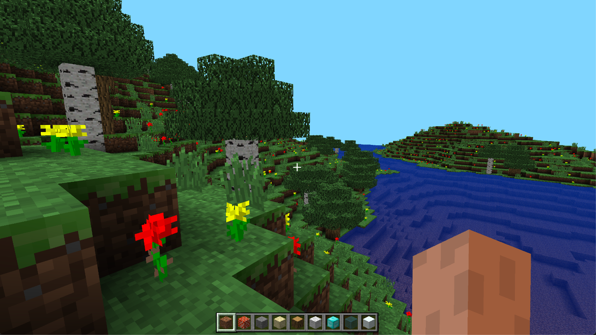

# OG.GG

PHP web application allowing tracking League of Legends players stats.



### Built With

* [![C++][C++]][C++]
* [![OpenGL][OpenGL]][OpenGL]


## Getting Started

### Installation
1. Clone the repo
```sh
git clone https://github.com/NaimanMpl/MinecraftClone.git
```
2. Install dependencies [GLM](https://glm.g-truc.net/0.9.9/) [GLFW](https://www.glfw.org/download) [Glad](https://glad.dav1d.de/) or get the binaires in /libraries
4. Compile
```sh
$ cd binaries
$ make
$ ./main
```

## License
Distributed under the MIT License. See `LICENSE.txt` for more information.

[OpenGL]: https://img.shields.io/badge/OpenGL-%23FFFFFF.svg?style=for-the-badge&logo=opengl
[C++]: https://img.shields.io/badge/C%2B%2B-00599C?style=for-the-badge&logo=c%2B%2B&logoColor=white
[PHP]: https://img.shields.io/badge/PHP-777BB4?style=for-the-badge&logo=php&logoColor=white
[Php-url]: https://www.php.net/
[Node.js]: https://img.shields.io/badge/Node.js-43853D?style=for-the-badge&logo=node.js&logoColor=white
[Nodejs-url]: https://nodejs.org/en
[React.js]: https://img.shields.io/badge/React-20232A?style=for-the-badge&logo=react&logoColor=61DAFB